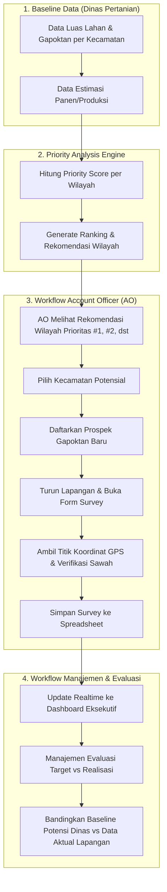

# PANDUAN TUGAS PER ROLE & ALUR KERJA SISTEM
## SIAP ALSINTAN Web (Fase 1)

Dokumen ini menjelaskan pembagian hak akses, peran, dan alur kerja (workflow) harian operasional untuk setiap role pengguna dalam sistem SIAP ALSINTAN.

---

## 1. Diagram Alur Bisnis Utama (End-to-End Workflow)

---

## 2. Rincian Tugas & Alur Kerja per Role

### 🌾 A. ROLE: ACCOUNT OFFICER (AO)
> **Fokus Utama:** Pelaksana lapangan yang bertugas mengidentifikasi, memprospek, dan memverifikasi kebutuhan alsintan Gapoktan di wilayah prioritas.

#### Menu yang Diakses:
1. **Dashboard AO** (`/ao`)
2. **Peta Potensi** (`/peta`)
3. **Prioritas Wilayah** (`/prioritas`)
4. **Data Prospek** (`/prospek`)
5. **Form Survey Lapangan** (`/survey`)

#### Alur Kerja Harian AO:
1. **Melihat Rekomendasi Wilayah:**
   - AO membuka **Dashboard AO** atau **Prioritas Wilayah**.
   - Sistem menampilkan ranking kecamatan dengan potensi tertinggi (misal: Kec. Cikampek, Skor 92, Luas Lahan 3.250 Ha, 42 Gapoktan).
2. **Menentukan Target Prospek:**
   - AO memilih kecamatan target dan mendaftarkan **Prospek Baru** pada menu Prospek (memasukkan Nama Gapoktan, Komoditas, estimasi alsintan yang diinginkan seperti *Combine Harvester* atau *Traktor*).
3. **Melakukan Survey Lapangan (Mobile-First):**
   - AO mendatangi lokasi sawah Gapoktan dengan smartphone.
   - Buka menu **Survey Lapangan** (`/survey`).
   - Klik tombol **"Ambil Titik GPS"** untuk merekam koordinat satelit aktual (Latitude, Longitude, Akurasi).
   - Isi luas sawah aktual hasil pengukuran dan ambil foto dokumentasi lahan.
   - Klik **"Kirim Hasil Survey"** (data tersimpan otomatis ke Google Spreadsheet).
4. **Update Status Prospek:**
   - Mengubah status prospek dari `BARU` ➔ `SURVEY` ➔ `POTENSIAL` ➔ `CLOSING`.

---

### 📊 B. ROLE: MANAJEMEN
> **Fokus Utama:** Pengambil keputusan, monitoring penetrasi wilayah, evaluasi efektivitas AO, dan analisis gap antara potensi baseline vs kondisi aktual.

#### Menu yang Diakses:
1. **Executive Dashboard** (`/dashboard`)
2. **Peta Potensi Wilayah** (`/peta`)
3. **Ranking Prioritas Wilayah** (`/prioritas`)
4. **Monitoring & Evaluasi** (`/monitoring`)
5. **Pipeline Prospek** (`/prospek`)
6. **Looker Studio Reporting** (Link Eksternal)

#### Alur Kerja Manajemen:
1. **Monitoring KPI Makro:**
   - Memantau total kecamatan tercover, total luas lahan teridentifikasi, dan jumlah pipeline prospek aktif di **Dashboard Utama**.
2. **Evaluasi Penetrasi Wilayah:**
   - Membuka menu **Peta Potensi** untuk melihat sebaran marker warna (Merah = Prioritas Tinggi, Kuning = Sedang, Biru = Rendah).
   - Memastikan tidak ada wilayah potensial tinggi yang terlewat oleh tim AO.
3. **Evaluasi Potensi vs Realisasi (Gap Analysis):**
   - Pada menu **Monitoring**, manajemen membandingkan jumlah Gapoktan baseline Dinas Pertanian dengan jumlah Gapoktan yang sudah berhasil diprospek oleh AO.
4. **Evaluasi Kinerja AO:**
   - Memeriksa metrik jumlah prospek, survey selesai, closing deal, dan *Conversion Rate (%)* per petugas AO.

---

### 🛡️ C. ROLE: ADMINISTRATOR (ADMIN)
> **Fokus Utama:** Pengelola master data, konfigurasi parameter sistem, dan pemeliharaan integrasi backend Google Apps Script.

#### Menu yang Diakses:
* **Seluruh menu sistem** (Dashboard, Peta, Prioritas, Prospek, Survey, AO, Monitoring, Pengaturan).

#### Alur Kerja Administrator:
1. **Registrasi & Penugasan AO Baru (Menu AO):**
   - Admin membuka menu **AO** (`/ao`) dan mengklik tombol **"+ Tambah AO Baru"**.
   - Memasukkan Nama Lengkap, Email login, dan memilih alokasi **Wilayah Penugasan Kecamatan** (misal: Kec. Cikampek, Kec. Purwasari).
   - Menetapkan status keaktifan AO (Aktif / Non-Aktif) yang tersimpan ke Google Spreadsheet (`MASTER_AO`).
2. **Manajemen Master Data:**
   - Menjaga integritas data `MASTER_WILAYAH`, `MASTER_KOMODITAS`, dan penugasan wilayah `MASTER_AO` di Google Spreadsheet.
3. **Konfigurasi Priority Engine:**
   - Menyesuaikan bobot persentase perhitungan jika ada perubahan kebijakan dari stakeholder (misal: menaikkan bobot produksi panen atau luas sawah).
4. **Pemeliharaan Integrasi:**
   - Memastikan URL deployment Google Apps Script aktif dan tidak mengalami timeout / limit quota.
   - Mengelola akun dan hak akses pengguna.

---

## 3. Matriks Hak Akses Antar Role

| Fitur / Modul | Administrator | Account Officer (AO) | Manajemen |
|---|:---:|:---:|:---:|
| **Executive Dashboard** | ✅ | ✅ | ✅ |
| **Peta Potensi Interaktif** | ✅ | ✅ | ✅ |
| **Ranking Prioritas Wilayah** | ✅ | ✅ | ✅ |
| **Lihat Semua Prospek** | ✅ | ❌ *(Hanya miliknya)* | ✅ |
| **Tambah Prospek Baru** | ✅ | ✅ | ❌ |
| **Input Survey & GPS Lapangan** | ✅ | ✅ | ❌ |
| **Lihat Riwayat Survey** | ✅ | ✅ *(Hanya miliknya)* | ✅ *(Semua)* |
| **Monitoring Kinerja AO** | ✅ | ❌ | ✅ |
| **Evaluasi Baseline vs Realisasi** | ✅ | ❌ | ✅ |
| **Pengaturan & Integrasi API** | ✅ | ❌ | ❌ |
